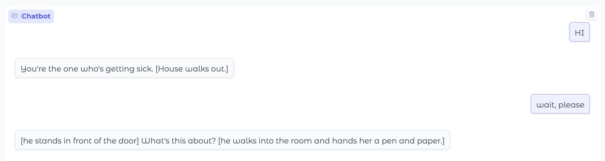
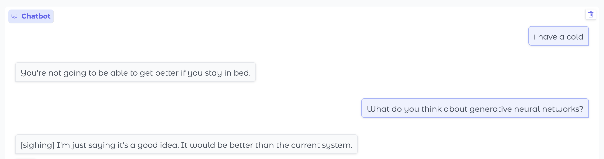
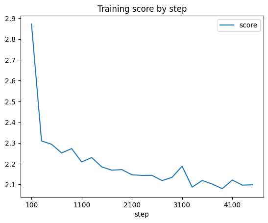
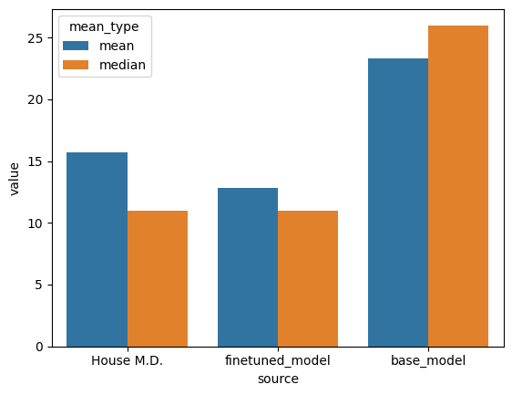
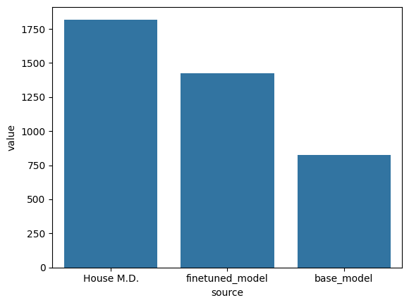
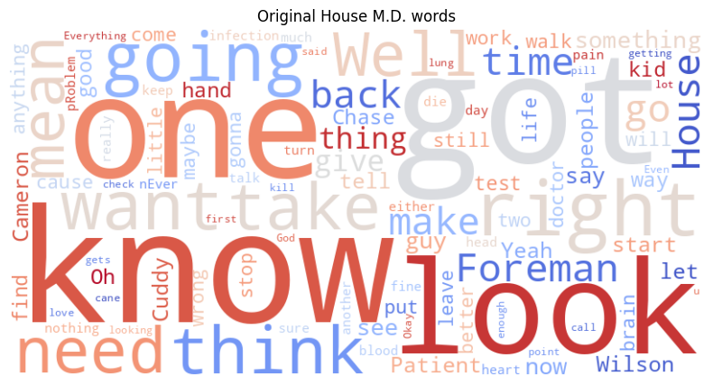
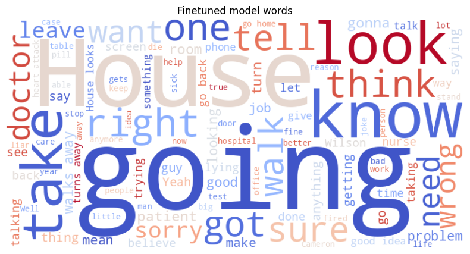
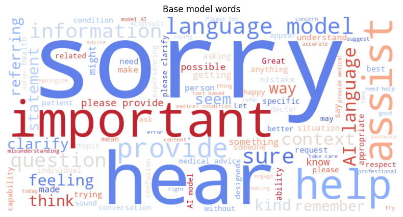
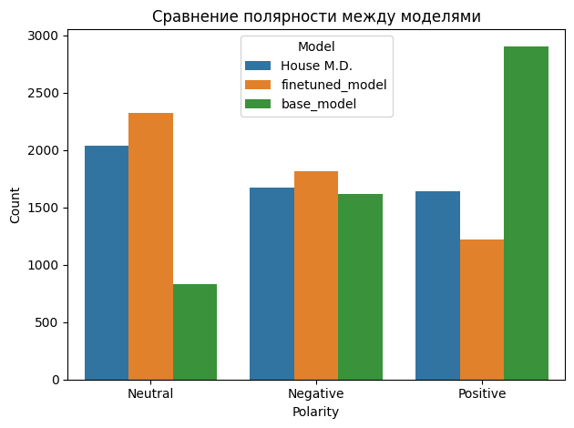

# Генеративный чат-бот по репликам доктора Хауса 
Чат бот был обучен на репликах из соответствующего сериала и пародирует Хауса

- Ссылка на Colab (там же можно найти обученные модели) https://drive.google.com/drive/folders/1n29SGQEOMoPCpHnv25fMWHGKoebCesVq?usp=sharing 
- За основу взята Qwen/Qwen2.5-0.5B-Instruct, обучение ускорялось с помощью LoRA

# Примеры работы

Иногда модель в квадратных скобках описывает пантомиму персонажей. Например: 
`You're the one who's going to have to be on your own, right? [To Chase] I'll tell you about it later.`

Такие случаи показались интересными и погружающими в Принстон-Плейнсборо, поэтому были оставлены

# График обучения
 

Видны небольшие колебания скора, но это нормально, график построен не по эпохам, а по степам

# Оценка результатов 
Поищем особенности речи Хауса, которые можно было бы оценить автоматически

- Реализация в файле `eval.ipynb`
- Подготовка данных к этому этапу в `inference.ipynb`. Данные для обучения и тестирования были поделены в пропорции 7/3. Оценка производилась только на тестовых данных, модель их не видела 

## Средняя длина реплики
Здесь считается средняя арифметическая и медианная длина ответов

По графику видно, что обученная модель ближе к настоящим ответам доктора Хауса. Медианная длина этих ответов совпадает, а средняя заметно ближе к оригиналу

## Вопросительные предложения
Посчитаем, сколько оригинальных реплик персонажа, обученной и базовой моделей содержали вопросительные предложения 

Не идеально, но видно, что обученная модель стала чаще задавать вопросы

## Частотности слов
Здесь потребовалась очистка от стопслов, лемматизация и даже частеречная разметка (выполнено с помощью nltk). Посмотрим, как выглядят облака слов:

Чтобы сделать выводы, желательно еще посмотреть частотности в виде таблицы (в файле `eval.ipynb`).

Интересно подметить следующее: 
- базовая модель добавляла слово "ai" в ответ, после файнтюна это изменилось (как и слово please)
- обученная модель успешно позаимствовала и лексику Хауса ("good") и особенно глаголы (в лидерах "get" и "go", но еще есть "tell", "think", "know", "sure", "say")
- по облаку слов базовой модели видно, как она пытается вежливо предложить помощь, извиниться, запросить больше контекста и объяснить, что она модель 

## Сантимент-анализ
Доктор Хаус извествен своей саркастичной манерой речи. С помощью модуля `nltk.sentiment` посмотрим, отразится ли это в сантимент-анализе 

На графике видно, что базовая модель была очень вежливой, что изменилось после обучения

# Контакты 
@tokelau